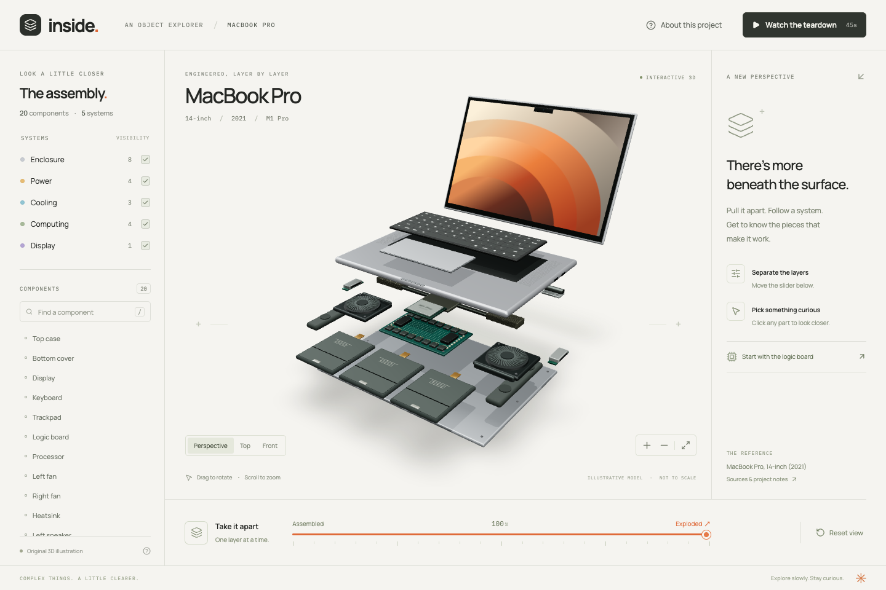

# Inside a MacBook

An interactive 3D study of the 14-inch MacBook Pro (2026, M5 Pro). Pull apart 20 original, simplified assemblies; explore five systems; select and isolate a component; and play a 24-second cinematic walkthrough.



## Run

Requires Node.js 22.13 or newer and npm.

```sh
npm ci
npm run dev
```

Open http://127.0.0.1:4173. No API keys, accounts, or external model downloads are required. Fonts are bundled locally.

## Explore

- Drag to orbit, scroll or use +/− to zoom.
- Scrub the bottom slider from assembled to exploded, or choose **All parts** for a labeled tray of all 20 assemblies. Selecting a tray item keeps every piece available.
- Toggle system visibility or search components. Press `/` to focus search.
- Select a part in the scene or list. Selecting an internal component from the list opens the assembly so you can see it.
- Isolate a component to inspect it; returning restores the previous system filters.
- Choose perspective, top, or front views. Reset restores the initial view and all components.
- Watch the teardown plays the shared model through a deterministic 24-second timeline. The completed demo leaves all 20 pieces ready to explore. Exit demo or press Escape early to return to your previous exploration state.

## Validate and build

```sh
npm run check
npm test
npm run build
npx playwright install chromium
npm run test:browser
```

Browser checks use a local Vite server automatically. Set `PLAYWRIGHT_CHROMIUM_EXECUTABLE_PATH` to use an existing Chromium executable. Production assets are written to `dist/`; serve that directory using a static host. The project does not deploy itself.

## Structure

- `src/data/parts.ts`: component explanations and system membership.
- `src/state/explorer.ts`: selection, filters, isolation, and explosion state.
- `src/scene/geometry.tsx`: original procedural meshes and textures.
- `src/scene/MacBook.tsx`: assembly transforms and picking.
- `src/scene/Scene.tsx`: lighting, camera controls, and rendering.
- `src/scene/timeline.ts`: reusable cinematic timeline.
- `src/App.tsx` and `src/styles.css`: responsive HTML interface.

## Video export

The export scripts capture the same deterministic 24-second timeline used by the website and encode a silent 1920 × 1080, 30 fps H.264 MP4. Start the app on port 4173, install Chromium as above, and make `ffmpeg` and `ffprobe` available:

```sh
node scripts/render-video.mjs
node scripts/verify-video.mjs --extract
```

The default output is `artifacts/inside-macbook-m5-pro.mp4`. The verifier checks codec, dimensions, duration, frame rate, and available frame count; `--extract` writes review frames. `PLAYWRIGHT_CHROMIUM_EXECUTABLE_PATH`, `FFMPEG_PATH`, and `FFPROBE_PATH` can select installed executables. Use `node scripts/render-video.mjs --help` for subset captures, resolution options, and safe resume behavior. The MP4 is generated locally rather than stored in Git. The verifier writes a JSON report alongside extracted review frames.

## Reference and accuracy

The geometry is an original educational illustration, not a service model. Dimensions, placement, component grouping, and exploded positions are simplified. The processor is shown separately for explanation; the scene is not a physical disassembly sequence. The reference set uses Apple’s [2026 M5 Pro specifications](https://support.apple.com/en-us/126318), [repair manual](https://support.apple.com/en-us/125819), and [exploded view](https://support.apple.com/en-us/125815), with fan and logic-board references linked in [ATTRIBUTION.md](ATTRIBUTION.md). Left and right refer to the seated user facing the keyboard; underside service images reverse the viewer’s left/right. Reference images are not redistributed with the app.

## License

Original source and procedural geometry are MIT licensed. Dependencies retain their own licenses.
